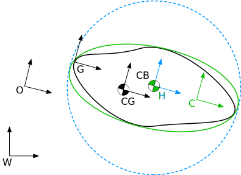

.. _dynamic-bodies:

==============
Dynamic bodies
==============

The dynamic bodies represent all of the rigid bodies that are not fixed to the world frame and require simulation of dynamics and hydrodynamics. It includes free bodies, constituting the dynamic parts of the :ref:`environment <environment>`, as well as :ref:`links of the robots <robot-links>`.

Common properties
=================

All of the dynamic bodies share the same mechanical properties which are used in the computation of forces governing their motion. 
An important feature of the *Stonefish* library is that these properties are computed automatically, based on provided geometry and material definitions, and include: mass, moments of inertia, volume, location of the centre of gravity (**CG**) and location of the centre of buoyancy (**CB**). 

Coordinate frames
^^^^^^^^^^^^^^^^^

The following diagram presents the coordinate frames defined for a dynamic body. The location of the frames is not realistic but only for illustration purposes. The shape of the body is described by: a graphical mesh (black), a mesh used for physics computations (green) and an approximation of the body geometry (dashed blue). There are 3 frames associated with these meshes: frame **G**, frame **C** and frame **H** respectively. The origin of the body is defined by frame **O**, which is used as a handle, to position the body in the world frame **W**.

Physics mode
^^^^^^^^^^^^

Dynamic bodies are affected by different forces, depending on the type of environment, the position of the body with respect to the ocean surface (if it is enabled) and the selected body physics mode. The last one was introduced as an optimization to help determine which forces have to be computed for a specific body and thus how the body should be prepared for the simulation. The physics mode of each dynamic body ``sf::BodyPhysicsType`` has to be selected from one of the following options:

-  ``SURFACE`` - no aerodynamic or hydrodynamic forces computed

-  ``FLOATING`` - buoyancy and hydrodynamic drag is computed, no added mass effect

-  ``SUBMERGED`` - buoyancy and hydrodynamic forces including added mass effect are computed

-  ``AERODYNAMIC`` - aerodynamic drag is computed (lift not supported for general bodies)

Collisions
^^^^^^^^^^

The *Stonefish* library uses a collision detection algorithm that approximates geometry of dynamic bodies to convex hulls. This feature significantly improves the performance of the simulation. Moreover, the library implements analytic collision points computation for basic solids, which should be used whenever possible. This not only further improves the performance, but also enables smooth collision response with standard curved surfaces. In case a non-convex collision is required, it is necessary to compose the dynamic body from multiple convex bodies, using the :ref:`compound body <compound-bodies>` type.

Defining physics configuration
^^^^^^^^^^^^^^^^^^^^^^^^^^^^^^

All dynamic bodies require a definition of the physics configuration, to be passed into their constructors. 
When using the XML parser, these settings are passed as attributes (see below). When using the C++ code, the physics configuration has to be defined using a special structure, before it can be passed to the body constructors, e.g.:

.. code-block:: cpp

    sf::BodyPhysicsSettings phy;
    phy.mode = sf::BodyPhysicsMode::SUBMERGED;
    phy.collisions = true;
    phy.buoyancy = true;

Creating dynamic bodies
^^^^^^^^^^^^^^^^^^^^^^^

The way of defining a dynamic body highly depends on its type. However, all of the dynamic bodies, except for the compound type, share some common properties:

1) **Name**: unique string

2) **Body type**: the type of the dynamic body

3) **Physics mode**: the physics computation mode

4) **Buoyant**: a flag indicating if the body is buoyant (optional)

5) **Material name**: the name of the material the body is made of

6) **Look name**: the name of the look used for rendering the body

7) **World transformation**: the transformation of the body origin in the world frame (position and orientation of the body)

.. code-block:: xml

    <dynamic name="{1}" type="{2}" physics="{3}" buoyant="{4}">
        <!-- definitions specific for a selected body type -->
        <material name="{5}"/>
        <look name="{6}"/>
        <world_transform xyz="{7a}" rpy="{7b}"/>
    </dynamic>

When creating the dynamic bodies in the C++ code, it is necessary to use a constructor of a specific body type. All of the dynamic body types are implemented as subclasses of ``sf::SolidEntity``.

.. note::

    In the following sections, description of each specific body type implementation is accompanied with an example of body instantiation through the XML syntax and the C++ code. It is assumed that a physical material called "Steel" and a look called "Yellow" were defined.

Overriding calculated properties
^^^^^^^^^^^^^^^^^^^^^^^^^^^^^^^^

It is possible to override some of the automatically calculated properties of a dynamic body. There are two methods to do it:

1) Set an arbitrary mass and allow the library to automatically scale the moments of inertia

.. code-block:: xml

    <dynamic>
        <!-- all standard definitions -->
        <mass value="30.0"/>
    </dynamic>

.. code-block:: cpp

    sf::SolidEntity* solid = ...;
    solid->ScalePhysicalPropertiesToArbitraryMass(30.0);

2) Set an arbitrary mass, moments of inertia and location of the CG

.. code-block:: xml

    <dynamic>
        <!-- all standard definitions -->
        <mass value="30.0"/>
        <inertia xyz="1.0 0.5 0.2"/>
        <cg xyz="0.2 0.0 0.0" rpy="0.0 0.0 0.0"/>
    </dynamic>

.. code-block:: cpp

    sf::SolidEntity* solid = ...;
    solid->SetArbitraryPhysicalProperties(30.0, sf::Vector3(1.0, 0.5, 0.2), sf::Transform(sf::IQ(), sf::Vector3(0.2, 0.0, 0.0)));

Parametric solids
=================

The most efficient dynamic bodies are parametric solids, which include: box, sphere, cylinder, torus and wing. The physical geometry of parametric solids is the same as the graphical mesh. Besides the wing body, the collisions of parametric solids are computed analytically. Definition of parametric solids always includes the ``dimensions`` tag. The attributes of this tag depend on the type of the solid. There is one standard attribute which is always available, called ``thickness``, used to define wall thickness if the user wants to create a shell body instead of a solid one.

1) Sphere ``type="sphere"`` - a sphere (ball) with a specified radius:

.. code-block:: xml

    <dynamic name="Sphere" type="sphere" physics="submerged" buoyant="true">
        <dimensions radius="0.5"/>    
        <origin xyz="0.0 0.0 0.0" rpy="0.0 0.0 0.0"/>    
        <material name="Steel"/>
        <look name="Yellow"/>
        <world_transform xyz="0.0 0.0 0.0" rpy="0.0 0.0 0.0"/>
    </dynamic>

.. code-block:: cpp

    #include <Stonefish/entities/solids/Sphere.h>
    sf::Sphere* sph = new sf::Sphere("Sphere", phy, 0.5, sf::I4(), "Steel", "Yellow");
    AddSolidEntity(sph, sf::I4());

1) Cylinder ``type="cylinder"`` - a cylinder with a specified radius and height, with its axis coincident with the local Z axis:  

.. code-block:: xml

    <dynamic name="Cyl" type="cylinder" physics="surface">
        <dimensions radius="1.0" height="2.0"/>
        <origin xyz="0.0 0.0 0.0" rpy="0.0 0.0 0.0"/>    
        <material name="Steel"/>
        <look name="Yellow"/>
        <world_transform xyz="0.0 0.0 0.0" rpy="0.0 0.0 0.0"/>
    </dynamic>

.. code-block:: cpp

    #include <Stonefish/entities/solids/Cylinder.h>
    sf::Cylinder* cyl = new sf::Cylinder("Cyl", phy, 1.0, 2.0, sf::I4(), "Steel", "Yellow");
    AddSolidEntity(cyl, sf::I4());

1) Box ``type="box"`` - a box with specified width, height and length:  

.. code-block:: xml

    <dynamic name="Box" type="box" physics="submerged" buoyant="true">
        <dimensions xyz="0.5 1.0 2.0"/>
        <origin xyz="0.5 0.0 0.0" rpy="0.0 0.0 0.0"/>    
        <material name="Steel"/>
        <look name="Yellow"/>
        <world_transform xyz="0.0 0.0 2.0" rpy="0.0 0.0 0.0"/>
    </dynamic>

.. code-block:: cpp

    #include <Stonefish/entities/solids/Box.h>
    sf::Box* box = new sf::Box("Box", phy, sf::Vector3(0.5, 1.0, 2.0), sf::Transform(sf::IQ(), sf::Vector3(0.5, 0.0, 0.0)), "Steel", "Yellow");
    AddSolidEntity(box, sf::Transform(sf::IQ(), sf::Vector3(0.0, 0.0, 2.0)));

1) Torus ``type="torus"`` - a torus with a specified major and minor radius, with its axis coincident with the local Y axis:

.. code-block:: xml

    <dynamic name="Torus" type="torus" physics="submerged" buoyant="true">
        <dimensions major_radius="1.0" minor_radius="0.1"/>
        <origin xyz="0.0 0.0 0.0" rpy="0.0 0.0 0.0"/>    
        <material name="Steel"/>
        <look name="Yellow"/>
        <world_transform xyz="0.0 0.0 0.0" rpy="0.0 0.0 0.0"/>
    </dynamic>
    
.. code-block:: cpp

    #include <Stonefish/entities/solids/Torus.h>
    sf::Torus* tr = new sf::Torus("Torus", phy, 1.0, 0.1, sf::I4(), "Steel", "Yellow");
    AddSolidEntity(tr, sf::I4());

1) Wing profile ``type="wing"`` - a solid based on an extruded NACA profile (4-digit system), aligned with local Y axis:

.. code-block:: xml

    <dynamic name="Wing" type="wing" physics="aerodynamic" buoyant="true">
        <dimensions base_chord="1.0" tip_chord="0.5" length="3.0" naca="4000"/>
        <origin xyz="0.0 0.0 0.0" rpy="0.0 0.0 0.0"/>
        <material name="Steel"/>
        <look name="Yellow"/>
        <world_transform xyz="0.0 0.0 0.0" rpy="0.0 0.0 0.0"/>
    </dynamic>

.. code-block:: cpp

    #include <Stonefish/entities/solids/Wing.h>
    sf::Wing* wing = new sf::Wing("Wing", phy, 1.0, 0.5, "4000", 3.0, sf::I4(), "Steel", "Yellow");
    AddSolidEntity(wing, sf::I4());

Arbitrary meshes
================

The dynamic bodies can be created based on arbitrary geometry, loaded from mesh files ``type="model"``. The geometry can be specified separately for the physics computation and the rendering. If only physical geometry is specified it is also used for rendering. The geometry can be loaded from STL or OBJ files (ASCII format). 

.. code-block:: xml

    <dynamic name="Mesh" type="model" physics="submerged" buoyant="true">
        <physical>
            <mesh filename="model_phy.obj" scale="1.0"/>
            <origin rpy="0.0 0.0 0.0" xyz="0.0 0.0 0.0"/> 
        </physical>
        <visual>
            <mesh filename="model_vis.obj" scale="1.0"/>
            <origin rpy="0.0 0.0 0.0" xyz="0.0 0.0 0.0"/>
        </visual>
        <material name="Steel"/>
        <look name="Yellow"/>
        <world_transform xyz="0.0 0.0 0.0" rpy="0.0 0.0 0.0"/>
    </dynamic>

The ``<origin>`` tag is used to apply local transformation to the geometry, i.e., transformation in the frame defined by the 3D software used to save the geometry. Optionally, if the user wants to create a shell body instead of a solid body, a line ``<thickness value="#.#"/>`` has to be defined between the ``<physical>`` tags. 

.. code-block:: cpp

    #include <Stonefish/entities/solids/Polyhedron.h>
    sf::Polyhedron* poly = new sf::Polyhedron("Poly", phy, sf::GetDataPath() + "model_vis.obj", 1.0, sf::I4(), sf::GetDataPath() + "model_phy.obj", 1.0, "Steel", "Yellow");
    AddSolidEntity(poly, sf::I4());

.. _compound-bodies:

Compound bodies
===============

A special type of dynamic body, called *compound*, can be used, for intuitive construction of a group of rigidly connected elements and/or enabling correct collision with non-convex geometry. A compound body is composed of external and internal parts, with at least one obligatory external part. Only the external parts are used when computing the drag forces, while all parts contribute to the buoyancy. 
Each of the parts is defined as parametric or mesh body, using the previously presented syntax. The difference lies in how these bodies are added to the simulation world by first combining them into one compound body.

An example of creating a compound body is presented below:

.. code-block:: xml

    <dynamic name="Comp" physics="submerged" type="compound">
        <external_part name="Part1" type="sphere" physics="submerged" buoyant="true">
            <dimensions radius="0.5"/>
            <origin xyz="0.0 0.0 0.0" rpy="0.0 0.0 0.0"/>
            <material name="Steel"/>
            <look name="Yellow"/>
            <compound_transform xyz="0.0 0.0 0.0" rpy="0.0 0.0 0.0"/>
        </external_part>
        <internal_part name="Part2" type="box" physics="submerged" buoyant="true">
            <dimensions xyz="0.5 0.1 0.1"/>
            <origin xyz="0.0 0.0 0.0" rpy="0.0 0.0 0.0"/>
            <material name="Steel"/>
            <look name="Yellow"/>
            <compound_transform xyz="0.25 0.0 0.0" rpy="0.0 0.0 0.0"/>
        <internal_part/>
        <world_transform xyz="0.0 0.0 5.0" rpy="0.0 0.0 0.0"/>
    </dynamic>

It should be noticed that when defining parts of a compound body the ``<dynamic>`` tag is replaced with ``<external_part>`` and ``<internal_part>`` tags. The ``<compound_transform>`` tag defined for each of the parts is used to determine the position and orientation of the part in the origin frame of the compound body and it replaces the ``<world_transform>``, which is now defined for the whole compound body, at the end.

.. code-block:: cpp

    #include <Stonefish/entities/solids/Sphere.h>
    #include <Stonefish/entities/solids/Box.h>
    #include <Stonefish/entities/solids/Compound.h>
    sf::Sphere* part1 = new sf::Sphere("Part1", phy, 0.5, sf::I4(), "Steel", "Yellow");
    sf::Box* part2 = new sf::Box("Part2", phy, sf::Vector3(0.5, 0.1, 0.1), sf::I4(), "Steel", "Yellow");
    sf::Compound* comp = new sf::Compound("Comp", phy, part1, sf::I4());
    comp->AddInternalPart(part2, sf::Transform(sf::IQ(), sf::Vector3(0.25, 0.0, 0.0)));
    AddSolidEntity(comp, sf::Transform(sf::IQ(), sf::Vector3(0.0, 0.0, 5.0)));