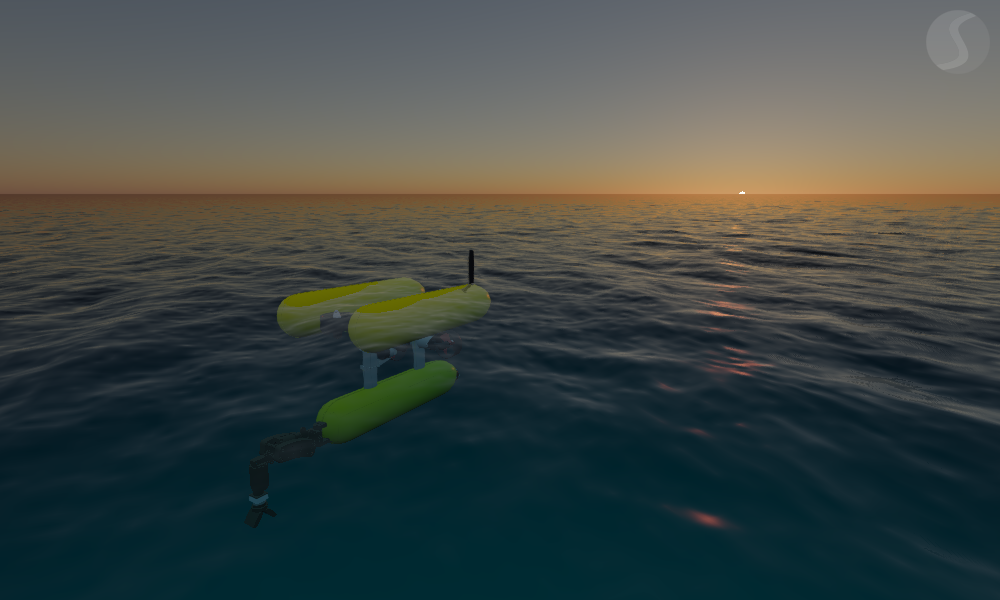

========
Overview
========

Features
========

In the following sections most importat features of the *Stonefish* library are presented. Features specifically implemented for the marine robotics research are written in **bold**. The full potential of the software can be appreciated by familiarizing with the subsequent chapters of the documentation.

Physics and collision
---------------------

The *Stonefish* library is used to build a dynamic simulation world with rigid body physics, **geometry-based hydrodynamics** and impulse-based collisions. Rigid body dynamics and collision simulation are supplied by the *Bullet Physics* library, while hydrodynamics and custom material models are implemented by the author. 

Kinematic trees of rigid bodies are supported and solved using the Featherstone's algorithm. Collision is detected analytically between simple solids, using convex hull algorithms for dynamic meshes and concave-convex algorithms for static meshes. Material properties include density and coefficient of restitution, while interaction between different materials is described by a table of static and dynamic friction coefficients. Moreover, physical properties of bodies - mass, volume, inertia - are automaticall computed based on the supplied geometry and defined material.

**Hydrodynamic and hydrostatic forces** are approximated taking into account the actual geometry of the bodies, to deliver effects not possible when using analytic equations. These forces include **buoyancy, different types of drag (linear, quadratic and skin) and added mass**. Thanks to using real geometry in computations, buoyancy of partially submerged bodies can be reallisticaly simulated, as well as, local water velocity is impacting the behaviour of the bodies.

Actuators, sensors and communication devices
--------------------------------------------

Apart from the pure physics simulation, the *Stonefish* library delivers a wide spectrum of virtual actuators, sensors and communication devices. 

Actuators is a group of devices that can propel a body by generating a force attached to it or drive joints of a multi-body chain. These include **thrusters** and propellers, servos and motors and a **variable buoyancy system (VBS)**. Lights are also considered actuators.

Sensors is a large group of different types of devices that can measure the interal states of the multi-body joints, the motion parameters of the bodies as well as environmental quantities. They can be divided into joint, link and vision sensors.
Joint sensors is the smallest group, containing encoders, torque and force sensors. Link sensors is the biggest group including: IMU, odometry sensors, **GPS, compass, pressure sensor, Doppler velocity log (DVL), profiler and multi-beam sonar**. Finally, vision sensors include all devices that generate an image like: color camera, depth camera, **forward-looking sonar (FLS), mechanical scanning imaging sonar (MSIS) and side-scan sonnar (SSS)**.

Comminication devices is the youngest group of simulated devices and it was created mainly to account for delays and directivity of communication underwater. The implemented communication devices include: **an acoutic modem and the ultra-short base line (USBL) device**.

Reallistic rendering
--------------------

Another unique feature of the *Stonefish* library is its custom rendering pipeline, closely coupled with the physics engine. The reasons of not using any of the available 3D graphics engines was to avoid bulkiness and deliver **high quality sky, ocean and underwater rendering**, often missing in the available open-source solutions. Special focus was put on the simulation of the underwater environment, where effects of **wavelength-dependent light absorption and scattering based on Jerlov measurements** were considered.

Screenshots
===========

.. image:: images/valve_panel.png
    :alt: Simulation window - robot operating a valve on an underwater panel.