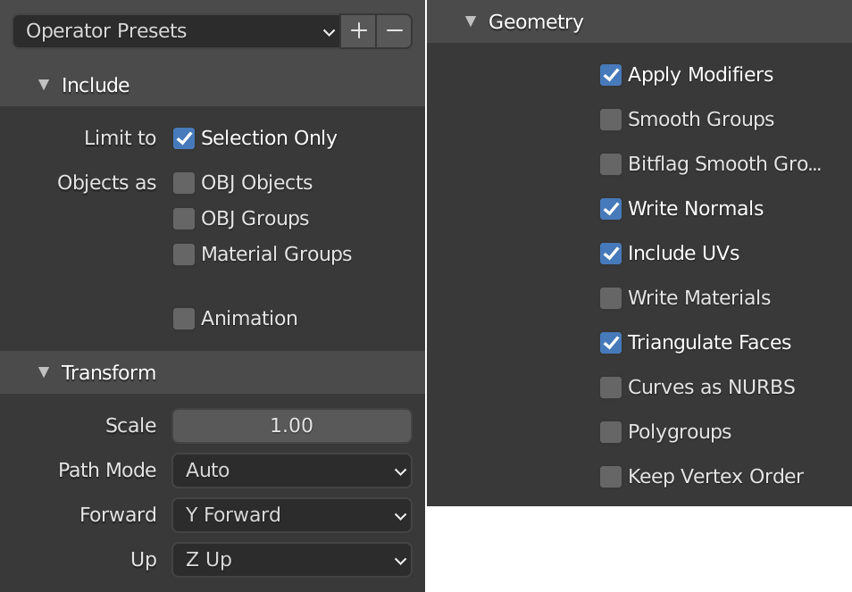

==============================
Defining a simulation scenario
==============================

The simulation scenario can be defined in two ways: by writing code or by using a scenario file parser. Both ways can also be combined, by first loading the scenario from a file and then modifying it using code. This gives access to the full functionality of the library, allows for non-standard definitions, as well as opens the possibility of using extensions developed for the library. In all cases, the definitions have to be placed inside the ``void BuildScenario()`` method of your subclass of ``sf::SimulationManager``.

Using the scenario file parser
==============================

For the convenience of the users, the *Stonefish* library implements a parser class for loading simulation scenarios from specially formulated scenario files. It is the preferred method of setting up the simulation scenarios, without the need of writing code. Loading a scenario from a file can be achieved through the following lines of code:

.. code-block:: cpp

    sf::ScenarioParser parser(this);
    parser.Parse("path_to_scenario_file");

Scenario file syntax
--------------------

Scenario files are `XML <https://www.w3.org/XML/>`_ files, with a syntax similar to the `URDF <http://wiki.ros.org/urdf>`_. Due to the unique features of the *Stonefish* library, some of the tags used in the scenario files are specific to it, and different from other formats. Every scenario file has to contain a root node called ``<scenario>``, i.e., all definitions have to be written between the tags ``<scenario> ... </scenario>``. All paths defined in the scenario files are automatically recognised as absolute if they begin with ``/`` or ``~``, or as relative to the data directory passed to the constructor of the ``sf::SimulationApp`` otherwise. Whenever an attribute requires passing multiple values, these values have to be separated by spaces, e.g., ``<world_transform rpy="0.0 3.1415 0.0" xyz="1.0 2.0 3.0"/>``.

A properly defined scenario file has to contain a set of **obligatory tags**, specifying the type of the simulated environment as well as the list of the materials and looks used throguhout the scenario. The rest of the definitions are used to actually create the simulated static bodies, dynamics bodies and robots. A skeleton of a scenario file is shown below:

.. code-block:: xml

    <?xml version="1.0"?>
    <scenario>
        <environment>
            <!-- Parameters of simulated environment -->
        </environment>
        <materials>
            <!-- Definitions of materials -->
            <friction_table>
                <!-- Interaction between materials -->
            </friction_table>
        </materials>
        <looks>
            <!-- Definitions of looks -->
        </looks>
        <!-- Definitions of bodies, robots, sensors... -->
    </scenario>

Include files
-------------

It is possible to **include one file in another**, to allow for the reuse of common definitions. The includes can only be used at the root level of the main file. Moreover, **looks can be defined at the root level of any include file**, to keep them together with the body definitions that they correspond to. **Physical materials can only be defined in the main file.** The include mechanism also supports passing arguments that are automatically replaced when loading the file contents. To define an argument the user has to add ``<arg name="{1}" value="{2}"/>`` to the ``<include>`` node, where {1} is the argument name and {2} is the argument value. In the included file the argument is retrieved by using ``$(arg {1})`` inside an attribute value. An example of including a file with arguments is presented below:

.. code-block:: xml

    <!-- main.scn -->
    <?xml version="1.0"?>
    <scenario>
        <!-- some definitions -->
        <include file="robot.scn">
            <arg name="robot_name" value="GIRONA500"/>
        </include>
    </scenario>

    <!-- robot.scn -->
    <?xml version="1.0"?>
    <scenario>
        <robot name="$(arg robot_name)" fixed="false">
            <!-- robot definitions -->
        </robot>
    </scenario>

Mathematical expressions
------------------------

The XML parser supports evaluating mathematical expressions for all numerical values. The result of the evaluation is always a double floating point number. A mathematical expression has to be written between ``${`` and ``}``.

Using the code
==============

Using the code to create simulation scenarios has a few possible benefits. First of all, it is necessary in case of extending the functionality of the *Stonefish* library, e.g., with new sensors, actuators or communication devices. This necessity can be dropped if the parser class is extended to include this new functionality. The other option is to load the standard definitions from a scenario file and add the missing elements with code. Secondly, the library code might expose properties and functions not supported by the parser, which may happen due to the difficulty in defining a particular functionality through the scenario file syntax. Finally, using code allows for implementing dynamically created simulation worlds, possibly with parametric functions, random distribution of bodies, generated terrain, etc.

When no scenario file is used, all of the obligatory definitions have to be written with code, in a specific order. Naturally, the materials and looks have to be defined before they can be used, which is not the case with the scenario file, in which the order of the tags does not matter. Moreover, the programmer is fully responsible for the correctness of the defined scenario, as any error checking mechanisms, implemented inside the parser, are not working anymore.

.. note::

    The rest of the documentation describes in detail how to define the obligatory properties of a simulation world, as well as every implemented object, that can be used in a simulation scenario. Each of the descriptions is accompanied by an XML snippet and its C++ twin, showing how to create objects using the scenario file syntax or the code.

.. _preparing-geometry:

Preparing geometry files
========================

To successfully setup a stable simulation scenario using the *Stonefish* library it is critical to use well prepared geometry files. This requirement comes directly from the fact that the geometry of the models is used for computation of physics. In all cases where mesh data is used to create simulated bodies, it is possible to sepearately define the visual and the physical geometry, where only the latter affects the simulation and needs to be properly preprocessed. Moreover, thanks to this separation between simulation and visualisation, the user can supply meshes of different resolution and level of detail, allowing for optimal simulation and high quality rendering at the same time.

Supported formats
-----------------

The library supports loading mesh data from the *Wavefront Object* (.obj) and the *STereo Lithography* (.stl) files, in ASCII format. It is strongly advised to use the former one, as more efficient and allowing for greater amount of information, e.g., texture coordinates. Both formats can be usually exported from a CAD software and then processed with many commercial or free 3D graphics programs, to optimize the geometry. 

.. warning::

    Material definitions in Wavefront Object files are not supported. You can use a texture if parts of the mesh should have different colors.

What is a good quality mesh?
----------------------------

When preparing a mesh representing the physical geometry of a simulated body it is important to follow these guidelines:

* **The mesh has to be closed!**
* The number of triangles should be as low as possible.
* The sizes of the triangles should be uniform along the mesh surface.
* The mesh should be sufficiently tesselated on curved surfaces.
* Any concave mesh should be manually split to a set of convex meshes if accurate collision is important.
* The normals of the mesh should be smoothed where appropriate.
* The mesh should be exported in a NED frame (Z axis looking down) to avoid unnecessary trasformations.
* The export script assumes that the mesh origin in aligned with the world origin!

Geometry workflow in Blender
----------------------------

The author of the library uses `Blender <https://www.blender.org>`_ to prepare the geometry for the simulations. It is an open-source graphics software of commercial quality, delivering the newest 3D tools for free, on all platforms. It can be used to create new 3D models as well as process models generated by CAD software. A typical workflow that can be used to prepare models for *Stonefish*, using *Blender*, consists of the following steps:

1. Import geometry from CAD software.

2. Rotate and move the mesh to align it with the NED frame (Z axis looking down).

3. Merge vertices by distance to obtain solid model.

4. Fix geometry if needed - fill holes, add missing parts, etc.

5. Apply "Decimate" modifier to reduce number of faces.

6. Tesselate big triangles if needed.

7. Turn on mesh normal smoothing.

8. Apply "Edge Split" modifier to recover hard edges.

9. Export mesh to the *Wavefront Object* file.

Export settings in Blender
--------------------------

The last step of the *Blender* workflow is exporting the finished geometry to a *Wavefront Object* file. To run the export script the user should first select the mesh to  be exported and choose **File > Export > Wavefront (.obj)** from the main menu. The exporter plugin has multiple settings, which have to be properly set for *Stonefish*. A screenshot of the export settings based on *Blender v2.90* is presented below.

.. warning::

    If multiple objects are selected during export, they will be joined together as one mesh.

Kinematic trees in Blender
--------------------------

*Blender* is a great tool for modelling robots made of multiple interconnected links. These kind of robots constitute a kinematic tree which can be properly set up using the parent-child functionality. However, to correctly export this kind of structure to the *Stonefish* simulator, a few steps have to be taken:

1. The origin of each link should be moved to the joint pivot and aligned with the joint axis.

2. The meshes should be moved to form the robot structure.

3. A proper hierarchy should be set using the parent-child functionality.

4. Position of joint pivots and direction of axes has to be noted for later definition of robot structure for the simulator.

5. Each mesh has to be moved to the world origin for export or the supplied export script has to be used (see below).

Due to the fact that each mesh has to be moved to the world origin and exported separately, which makes the process tediuos and requires to keep a copy of the scene before the export, the author has written a simple *Python* script that can be run inside *Blender*, to automatise the process in an indestructive manner. Before running the script the user has to select all links of the robot. The script can be run in the **Scripting** workspace, by pasting the following code:

.. code-block:: python

    import bpy
    import os

    # Write exported meshes to the ".blend" file location
    basedir = os.path.dirname(bpy.data.filepath)
    if not basedir:
        raise Exception("Blend file is not saved!")

    # Save viewport state
    view_layer = bpy.context.view_layer
    obj_active = view_layer.objects.active
    selection = bpy.context.selected_objects
    bpy.ops.object.select_all(action='DESELECT')

    for obj in selection:
        # Select single object
        obj.select_set(True)
        view_layer.objects.active = obj

        # Move object to the world origin
        orgLoc = obj.location.copy()
        obj.location = (0.0, 0.0, 0.0)
    
        # Export object
        name = bpy.path.clean_name(obj.name)
        fn = os.path.join(basedir, name)
        bpy.ops.export_scene.obj(filepath=fn + ".obj", use_selection=True, use_edges=False, use_materials=False, use_triangles=True, axis_forward='Y', axis_up='Z')

        # Move object back to its original location    
        obj.location = orgLoc
        obj.select_set(False)
        print("Written:", fn)

    # Restore viewport state
    view_layer.objects.active = obj_active
    for obj in selection:
        obj.select_set(True)